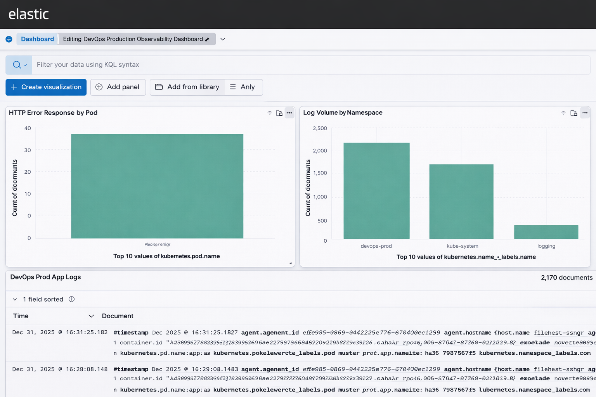

# 🚀 DevOps Production Platform
**Kubernetes | CI/CD | ELK Observability**

A production-style DevOps platform demonstrating CI/CD automation, Kubernetes orchestration, autoscaling, and centralized logging using the Elastic Stack (ELK).

---

## 📌 Project Highlights

- 🔁 End-to-end CI/CD using Jenkins
- 🐳 Dockerized application
- ☸️ Kubernetes deployment (Minikube)
- 📈 Horizontal Pod Autoscaling (HPA)
- 📊 Centralized logging & observability with ELK
- 🧱 Infrastructure as Code using Terraform
- 🔒 Secure repository with best-practice `.gitignore`

---

## 🏗️ Architecture Overview


### Architecture Flow
1. Developer pushes code to GitHub
2. Jenkins pipeline builds Docker image
3. Image pushed to Docker Hub
4. Kubernetes deploys application pods
5. HPA automatically scales pods
6. Filebeat collects container logs
7. Elasticsearch stores logs
8. Kibana provides dashboards & alerts

---

## 📊 Observability Dashboard (Kibana)

A single centralized dashboard provides:
- Application error visibility
- Log volume by namespace
- Interactive filters (namespace, pod, container)
- Real-time troubleshooting



---

## 🧰 Technology Stack

| Layer | Tools |
|-----|------|
| CI/CD | Jenkins |
| Container | Docker |
| Orchestration | Kubernetes |
| Autoscaling | HPA |
| Logging | Filebeat |
| Search | Elasticsearch |
| Visualization | Kibana |
| IaC | Terraform |

---

## 📁 Repository Structure

```bash
devops-prod-platform/
├── app/                 # Application source code
├── docker/              # Dockerfile
├── k8s/                 # Kubernetes manifests
├── logging/             # ELK stack manifests
├── terraform/           # Infrastructure as Code
├── screenshots/         # Architecture & dashboard images
├── Jenkinsfile          # CI/CD pipeline
├── .gitignore           # Security best practices
└── README.md
